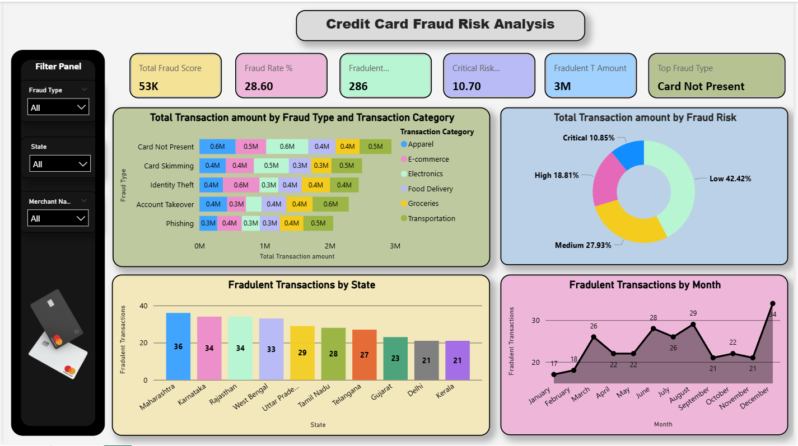

# 💳 Credit Card Fraud Risk Analysis  

---

## 📘 Overview  

The **Credit Card Fraud Risk Analysis Dashboard** is a Power BI project designed to detect and visualize patterns in fraudulent transactions.  
By analyzing fraud types, transaction categories, states, and time periods, this dashboard helps financial institutions **identify potential risks**, **understand fraud behavior**, and **make data-driven decisions** to reduce fraud impact.

---

## 🎯 Objective  

To build an **interactive, data-driven Power BI dashboard** that provides actionable insights into credit card fraud patterns — enabling early risk detection and improved fraud management strategies.

---

## 🧠 Key Highlights  

| Metric | Value |
|--------|--------|
| **Total Fraud Score** | 53K |
| **Fraud Rate (%)** | 28.60% |
| **Critical Risk (%)** | 10.70% |
| **Fraudulent Transactions** | 286 |
| **Fraudulent Transaction Amount** | 3M |
| **Top Fraud Type** | Card Not Present |

---

## 📊 Dashboard Features  

### 🔹 Fraud Overview Metrics  
Instantly visualize KPIs like Fraud Rate %, Fraud Score, Critical Risk %, and Top Fraud Type for a quick overview.

### 🔹 Fraud Type vs Transaction Category  
Clustered bar chart comparing fraud types (Card Skimming, Phishing, Identity Theft, etc.) across transaction categories (Apparel, Groceries, Transportation, etc.).

### 🔹 Fraud Risk Distribution  
Doughnut chart representing fraud segmentation by risk level: **Critical (10.85%)**, **High (18.81%)**, **Medium (27.93%)**, **Low (42.42%)**.

### 🔹 Fraudulent Transactions by State  
Identifies regional fraud hotspots — **Maharashtra**, **Karnataka**, and **Rajasthan** top the list.

### 🔹 Monthly Fraud Trend  
Line chart showing monthly fraud variations, with **December** being the most fraudulent month (34 cases).

### 🔹 Interactive Filter Panel  
Dynamic slicers for **Fraud Type**, **State**, and **Merchant Name**, allowing seamless drill-down and focused analysis.

---

## 🧩 Tools & Technologies  

| Category | Tools / Technologies |
|-----------|----------------------|
| **Visualization** | Power BI Desktop |
| **Data Cleaning & Transformation** | Power Query |
| **Computation** | DAX (Data Analysis Expressions) |
| **Data Source** | Excel / CSV Transaction Data |
| **Design Focus** | Intuitive UI, Insightful Storytelling, KPI Alignment |

---

## ⚙️ Data Preparation Challenges  

During development, I encountered several real-world data challenges:
- **Messy & unstructured data** with missing values and inconsistent merchant names.  
- **Overlapping fraud categories** requiring logical mapping and standardization.  
- **Complex DAX measures** to accurately compute *fraud rate*, *critical risk %*, and *total fraud score*.  
- Achieving **visual balance** — ensuring visuals not only looked aesthetic but answered the *right business questions*.  

Through iterative refinement and testing, I achieved a dashboard that delivers **clarity, accuracy, and business impact**.

---

## 💼 Business Impact  

- Identified **high-risk states and months**, enabling targeted fraud monitoring.  
- Highlighted **transaction categories with high fraud exposure**, improving risk modeling.  
- Enabled **data-driven decision-making** for fraud prevention and loss reduction.  

---

## 🧭 How to Use  

1. Download the `.pbit` Power BI Template file.  
2. Open it in **Power BI Desktop**.  
3. Connect your dataset (or use the provided sample data).  
4. Explore fraud insights interactively using slicers and visuals.  

---

## 🏷️ Tags  
`#PowerBI` `#DataAnalytics` `#FraudDetection` `#DashboardDesign` `#DataVisualization` `#BusinessIntelligence` `#CreditCardFraud`  

---

## 👨‍💻 Author  

**Charan Karthik Nayakanti**  
🎓 *Data Analytics & Machine Learning Enthusiast*  
🌐 [LinkedIn](./linkedin.com/in/charan-karthik/) • 💼 [GitHub](./https://github.com/mrkarthik14) • ✉️ charankarthiknayakanti@gmail.com
👉 [Portfolio](./charan-karthik-nayakanti.lovable.app)

---

> ⭐ *If you found this project insightful, don’t forget to star the repository and share your feedback!*  
>  
> _“Turning raw data into insight is where analytics becomes intelligence.”_

---
